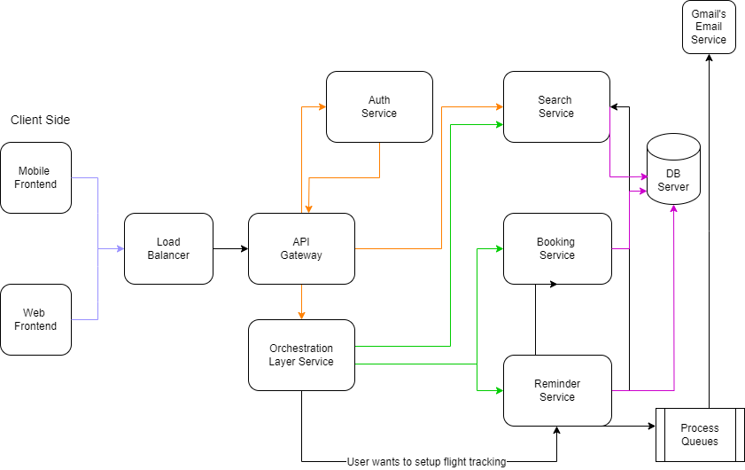

# **Airline Booking Backend System-Design Doc**

 
<h3>Objective</h3>
We need to build a backend system that can support different features for an airline company. Our end user is going to be someone who wants to book flights and query about flights so we need a robust system to actually give the best experience possible.

This Doc is solely going to focus on the backend part of the system. We want to prepare the backend keeping the fact in mind that the codebase should be as maintainable as possible.

<h3>Functional Requirements</h3>
<i><u>Note:[V2] - Denotes that these features are for future enhancement.</i></u>

- A user should be able to search for flights from one place to another.
    - User should be able to mention the source and destination details.
    - User should be able to select the date of journey.
        - <i><u>[V2]User should be able to search for return flights and multi city flights.</i></u>
    - User should be able to select the class of the flights(Non mandatory)
    - User should be able to select the no of seats they want to book(Non mandatory)
    - Now based on above data, we will list down flights.
    - We should show our users best available flights at the top based on time period of flight and then based on price.
    - We need to support pagination so that we can list chunk of flights at one point of time.
    - We should support filter of flights based on price, departure time, duration.
        - <i><u>[V2] - We can add support for more filters.</i></u>
- A user should be able to book a flight considering that user is registered on the platform.
    - User should be able to cancel a booking, then based on some criteria we can initiate refund for them.
- For making a booking, user has to make a payment [dummy].
- Tracking flight prices should be possible, user should be notified about any price drops, or any delay.
- User should be able to list their previous and upcoming flights.
- User should be able to download boarding pass if they have done online check-in.
- Online check in mechanism should be supported.
- Notifications via email for completing online check-in before 3 hours of departure.
- Notification to user about any flight delay.
  - Review mechanism should involve star rating along with a comment.
    - While listing any flight, we should display the review of the flight.
- User should be able to authenticate to our system using email and password.
    - <i><u>[V2]-Support ticketing, where user can raise their queries.</i></u>
- Listing FAQs which will be static data.
    - <i><u>[V2]-Prepare seat selection</i></u>
- Coupons for discount and offers.
- While making a booking, a person can reserve more than one seats with one login id.

<h3>Non Functional Requirements</h3>
- We can expect that we are going to have more flight searches than flight bookings.
- System needs to be accurate in terms of booking.
- Expect that we will be having approx 1,00,000 total users, 5,00,000 bookings might come up in one quarter.
- So in one day, we can expect 5,000 bookings.
- System should be capable of scaling up to atleast 3x the current estimated traffic.
- The system should handle realtime updates to flight prices, before user makes the final booking.
- Concurrency should be handled, using RDBMS should be good solution.

Capacity Estimation:

- Storage estimates -
    - For upcoming 5 years, 80,00,000 bookings, 2,00,000 Users, Considering all users records and booking records take 10 MB of data, then overall 10 TB of memory should be fine for our pilot run.
- Traffic estimates -
    - If we consider 30:1 as the search:booking ratio, then at max we expect 1,50,000 search queries a day. 2 query/second.

<h1>High-Level Design Diagram</h1>

